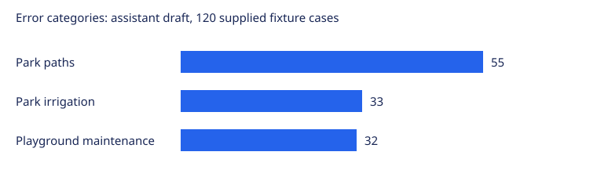

# تحليل أخطاء Lab 6 — Step 4

هذه مسودة تحليل أعدّها المساعد بعد قراءة نصوص الحالات الـ120. خانات المراجعين بقيت فارغة، والحالة `assistant_draft`؛ لم تُسجّل مراجعة بشرية ثنائية.

## ماذا ظهر في الحالات؟

أبرز ملاحظة أن الأخطاء ليست موزعة على موضوعات مختلفة: التصنيف الصحيح في العينة كلها هو الحدائق، والتوقع المسجل هو الطرق. النصوص نفسها تتحدث عن ممرات داخل الحدائق، أو توقف الري، أو صيانة ألعاب الأطفال. لذلك أضفنا فئة «خلط تصنيفي» مع ثلاثة أقسام تصف الخدمة المذكورة. هذه الأقسام تصف الخطأ الظاهر، ولا تدّعي معرفة السبب الداخلي للنموذج.

مثلًا، الحالة FB-000488 تتحدث عن ممر غير مناسب للكراسي المتحركة داخل حديقة. وجود «طريق الملك فهد» في اسم المكان قد يشتت التصنيف، لكن لا يمكن إثبات ذلك من التوقع وحده. وفي FB-005608، المشكلة هي ري الحديقة؛ قد نحتاج توضيح الحد الفاصل بين الحدائق والمياه، لكن النص لا يدعم تصنيف الطرق. أما FB-002288 فيطلب صيانة ألعاب الأطفال، وهو مثال واضح على خدمة تخص الحديقة.

## نطاق البيانات

العينة ثابتة: 120 حالة دون تكرار للمعرّفات، سُحبت من 300 خطأ بعد ترتيبها حسب feedback_id وبذرة 42. رُبطت بالنصوص الأصلية من bayan_feedback.csv؛ جميعها من validation، وتسمياتها مطابقة للمصدر. جميع الحالات موسومة بأنها اصطناعية في البيانات، وتكرار الصياغات يقلل تنوع الأدلة.

مصدر التوقعات هو validation_predictions.csv المرفق. لا يحدد الملف النموذج الذي أصدرها؛ لذلك لا ننسب هذه الأخطاء إلى نموذج CAMeLBERT المحلي. قبل إعادة التدريب، نحتاج إعادة إنتاج التوقعات من النموذج المقصود وتوثيق نسخته وربط كل توقع بمعرّفه. هذا فحص لصحة التقييم، وليس تحسينًا مقاسًا للدقة.

## توزيع الأخطاء

| Category | Count | Share |
|---|---:|---:|
| خلط تصنيفي: ممرات الحديقة | 55 | 45.83% |
| خلط تصنيفي: ري الحديقة | 33 | 27.50% |
| خلط تصنيفي: صيانة ألعاب الحديقة | 32 | 26.67% |
| Total | 120 | 100% |

تفاصيل كل حالة وشاهدها واقتراحها في [ورقة التحليل](../data/eval/error_review_120.csv). كل حالة محسوبة مرة واحدة حسب فئتها الأساسية. السمات الثانوية مثل الإملاء وأسماء الطرق قد تتداخل، ولا تدخل في مجموع الأعمدة.

لم أصنّف هذه الحالات على أنها قصّ للنص أو خلل في المعالجة أو عيب في الوسوم؛ النص والتوقع وحدهما لا يثبتان هذه الأسباب. كذلك لم أعتبر اختلاف كتابة الهمزة سببًا مؤكدًا لمجرد ظهوره.

## أهم ثلاثة تحسينات

| الأولوية | التغيير المقترح ودليله | الأثر المتوقع المشروط |
|---|---|---|
| 1 | تدريب أمثلة متقابلة تفرق بين خدمة داخل الحديقة وخدمة الطريق العام، مع توضيح أين يصنّف ري الحدائق. الشواهد: FB-000488 وFB-005608 وFB-002288. تُكتب أمثلة تدريب جديدة؛ لا تُنقل حالات التحقق إلى التدريب. | إذا صحّح هذا التغيير 12–24 حالة من العينة دون إفساد أي توقع آخر، تزيد Accuracy على ملف الـ2400 بمقدار 0.50–1.00 نقطة مئوية. |
| 2 | تبديل أسماء الأماكن في أمثلة التدريب وإضافة اختبار ثبات لها: نفس طلب صيانة الألعاب مع اسم حي ثم اسم شارع. الشواهد: FB-002288 وFB-004568 وFB-007408. الهدف التأكد أن اسم الطريق لا يطغى على الخدمة المطلوبة. | إذا صُحّحت 6–12 حالة دون أخطاء جديدة، تكون الزيادة 0.25–0.50 نقطة مئوية على الملف نفسه. |
| 3 | مقارنة النص الأصلي بنسخة مصححة إملائيًا، ثم تجربة تطبيع عربي مناسب أو تنويعات تدريب إذا ثبت التحسن. الشواهد: FB-001768 وFB-004048 وFB-002528. لا نغيّر المعالجة المشتركة دون فحص تأثيرها على بقية الحالات. | إذا صُحّحت 1–3 حالات دون أخطاء جديدة، تكون الزيادة نحو 0.04–0.13 نقطة مئوية على الملف نفسه. |

هذه الأرقام سيناريوهات تخطيطية وليست مكاسب مقاسة أو توقعات إحصائية مستنتجة من التجربة. الحساب هو عدد التصحيحات المفترض ÷ 2400 × 100؛ لا نفترض انتقال الأثر إلى باقي البيانات. قد تكون النتيجة صفرًا أو تراجعًا، وقد تتداخل الحالات بين التحسينات، لذلك لا تُجمع المكاسب. يُقاس الأثر الفعلي على بيانات تحقق مستقلة مع مراجعة Macro-F1 وفترات الثقة أيضًا.

## التصنيف المستخدم

احتُفظ بالفئات الأصلية في دليل التصنيف، وأضيفت فئة 9: «خلط تصنيفي»؛ أقسامها ألعاب الحديقة وري الحديقة وممرات الحديقة. تُستخدم عندما يكون اختلاف الخدمة بين الوسم والتوقع ظاهرًا، دون توفر دليل كافٍ على السبب التقني.

تحليل أعدّه المساعد لـ120 حالة.
